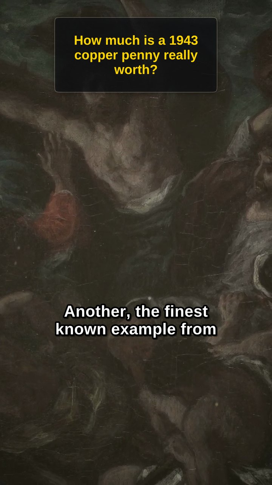
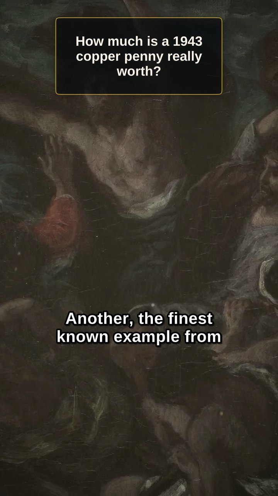
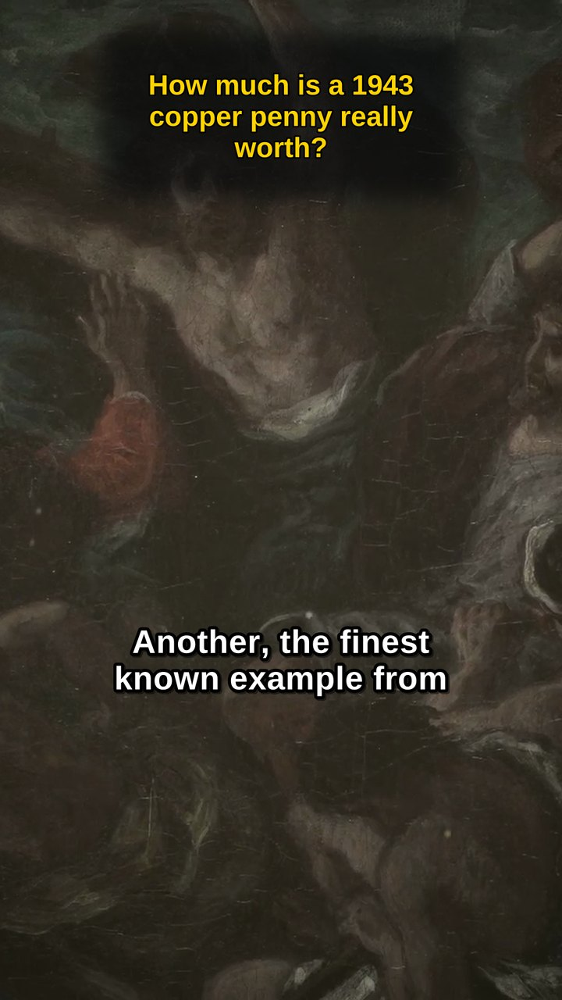
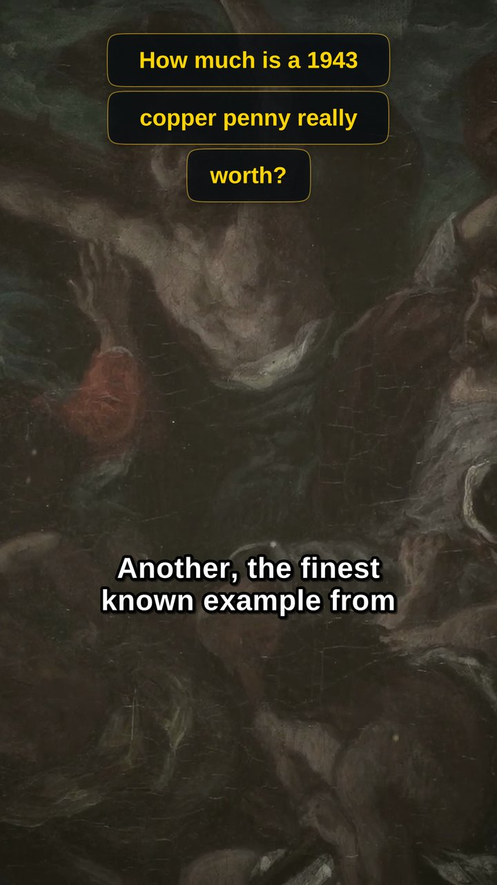

# Шапка шортса — четыре направления

Кадры сняты с настоящего `final.mp4` эпизода **ff-ep08** (862-я секунда),
а не нарисованы мокапом: ровно так шапка выедет в кадре.

Сейчас в конвейере — вариант, близкий к **D**, но без прозрачности и
скруглений: две плотных чёрных плашки. Заменяем.

Общее у всех четырёх: панель **одна на весь вопрос** вместо коробки на
каждую строку, она **полупрозрачная** и **скруглённая**. Рисует её сам
libass в режиме векторного рисования (`\p1`), отдельного прохода ffmpeg
или overlay-слоя не нужно.

Анимация вступления во всех вариантах одна: крупный вопрос по центру
кадра 0.9 с (`INTRO_HOLD`), затем 0.65 с (`INTRO_SHRINK`) уезжает наверх
и уменьшается в свою панель.

| | вариант | что это | чем платим |
|---|---|---|---|
| **A** | Стекло | одна панель, затемнение ~70%, тонкий светлый кант, мягкая тень | спокойно и дорого, но «кричит» меньше всех |
| **B** | Золотой кант | та же панель, кант золотой, текст кремовый вместо жёлтого | фирменнее под аукционы, но кремовый бьёт слабее жёлтого |
| **C** | Без рамки | только размытое затемнение под буквами, края растворяются | чище всех, но на светлом кадре пятно заметно |
| **D** | Капсулы | строка — своя «таблетка» со скруглёнными торцами и золотым кантом | живее прочих, но рваный правый край на длинном вопросе |

## A — Стекло


## B — Золотой кант


## C — Без рамки


## D — Капсулы


## Как пересобрать кадры

`variants.py` рядом — самостоятельный скрипт, конвейера не касается.
Нужен готовый `final.mp4` (путь задан в начале файла) и `ffmpeg`:

```
python3 docs/shorts-header/variants.py
```

Кладёт `A_glass.png`…`D_capsule.png` рядом с собой. Правится в одном
месте: у каждого варианта своя функция, панель считается из измеренной
PIL ширины строк, так что менять кегль и отступы можно не пересчитывая
геометрию руками.
